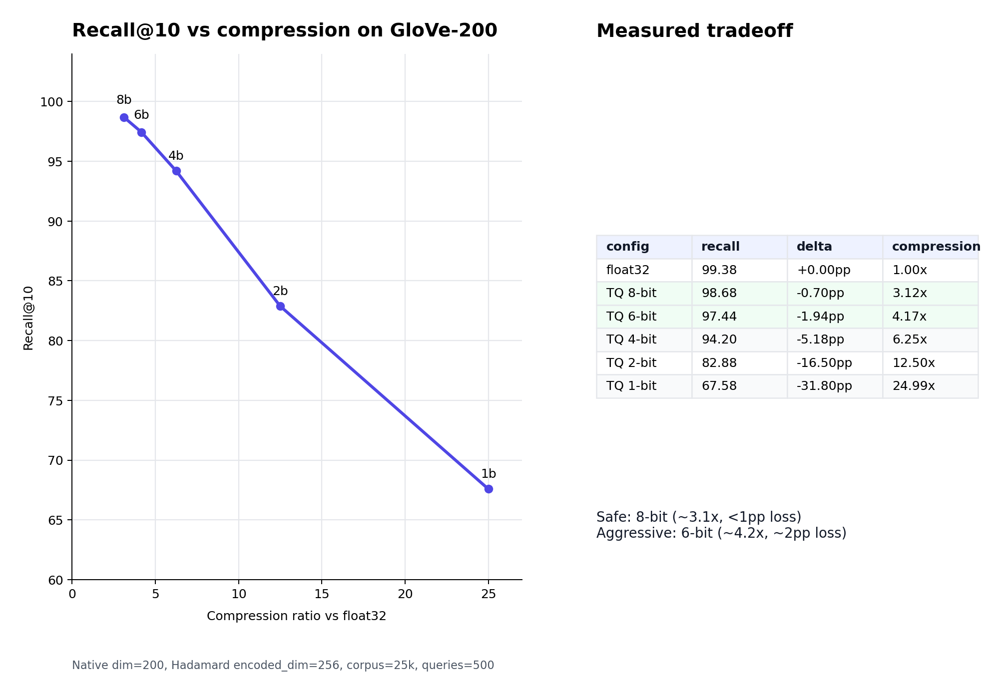

# TurboQuant x HNSW: GloVe Scaling Curve

[](https://huggingface.co/spaces/olanokhin/hnsw-turboquant-glove)
[](https://huggingface.co/datasets/olanokhin/glove-6b-200d-vectors)
[](https://www.python.org/)
[](https://www.gradio.app/)
[](LICENSE)

Live demo: https://huggingface.co/spaces/olanokhin/hnsw-turboquant-glove



This project benchmarks a TurboQuant-style vector compression pipeline on real
GloVe-200 embeddings, then measures how compression changes HNSW Recall@10.

## Result

Default benchmark setup:

- dataset: `olanokhin/glove-6b-200d-vectors`
- native dimension: `200`
- encoded dimension: `256` after Hadamard padding
- corpus vectors: `25,000`
- queries: `500`
- HNSW: `ef_construction=200`, `M=16`

Representative result from the live demo:

| Config | Compression | Recall@10 delta | Interpretation |
|---|---:|---:|---|
| TQ 8-bit | 3.12x smaller | -0.7pp | Safe sweet spot |
| TQ 6-bit | 4.17x smaller | -1.9pp | Aggressive sweet spot |
| TQ 4-bit | 6.25x smaller | -5.2pp | Recall starts to break |

The practical takeaway: **8-bit is the safe setting; 6-bit is the aggressive
setting; 4-bit is not a drop-in replacement without reranking.**

## What It Does

- L2-normalizes GloVe-200 vectors for cosine search.
- Applies randomized Hadamard rotation.
- Fits Lloyd-Max scalar codebooks for `1, 2, 4, 6, 8` bits.
- Reconstructs vectors and builds a standard HNSW index.
- Plots Recall@10 vs compression ratio.

The demo intentionally exposes `encoded_dim=256`: native GloVe-200 must be
padded to a power of two for the Hadamard transform, so real compression is
below the ideal bit-width ratio.

## Run Locally

```bash
python3 -m pip install -r requirements.txt
python3 app.py
```

By default, the app loads the prepared Hugging Face dataset:

```text
HF_DATASET_ID=olanokhin/glove-6b-200d-vectors
HF_DATASET_SPLIT=train
HF_VECTOR_COLUMN=vector
```

To run against a local Stanford GloVe file instead:

```bash
GLOVE_TXT_PATH=/path/to/glove.6B.200d.txt python3 app.py
```

## Dataset Prep

The helper script converts `glove.6B.200d.txt` into a Hugging Face Dataset with
columns `word` and `vector`:

```bash
python3 scripts/prepare_glove_dataset.py /path/to/glove.6B.200d.txt \
  --limit 30000 \
  --push-to-hub olanokhin/glove-6b-200d-vectors
```

## Limitations

This is a Python/Gradio benchmark, not a production vector database
implementation. It reconstructs float32 vectors before HNSW. A production
engine would store compressed codes directly and score them through codebook
lookup with SIMD kernels.

## Resume Bullet

Benchmarked TurboQuant-style HNSW compression on GloVe-200, mapping Recall@10
vs compression across 1-8 bits and identifying 8-bit as the safe sweet spot
(~3.1x smaller, <1pp recall loss).
